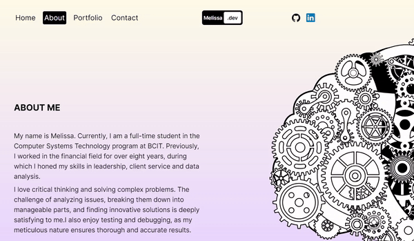

# Melissa's Portfolio

<div style="text-align: center;">
  Welcome to Melissa's Portfolio Website !<br><br>
</div>

<div style="text-align: center;">
  
</div>


## Tech Stack

React, Next.js, Framer Motion, EmailJS, Tailwind CSS


## Demo

https://melissa-portfolio-website.vercel.app


## Installation

Install the project with npm

```bash
  cd Melissa-Portfolio-Website
  npm install
  npm run dev
```
    
## Introduction

This website is developed using Next.js 14, a robust framework for building web applications. For more information, you can visit the [Next.js 14](https://nextjs.org/blog/next-14).

The animation effects are created using Framer Motion, a powerful React animation library that's ready for production and optimized for high-performance interactive applications. For more details, you can check out the [Framer Motion animation](https://www.framer.com/motion/animation/).


The email service is powered by EmailJS, a straightforward email service designed for developers. For more information, you can visit the [EmailJS documentation](https://www.emailjs.com/docs/).

## Reference
 [Lama Dev](https://www.youtube.com/watch?v=DJaZUFK8Kv4) | [Next.js](https://nextjs.org/blog/next-14) | [Framer Motion](https://www.framer.com/motion/animation/) | [EmailJS](https://www.emailjs.com/docs/) | [Tailwind CSS](https://www.youtube.com/watch?v=DJaZUFK8Kv4)| [OpenAI](https://openai.com)


## Credits
- Project landing image designed by [OpenAI](https://openai.com)
- Icons used from [Freepik](https://www.flaticon.com/authors/freepik)

## Authors

- [@Melissa-Shao](https://github.com/Melissa-Shao)

